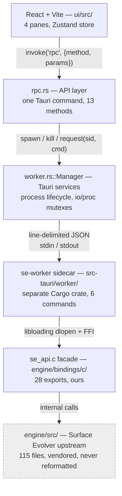
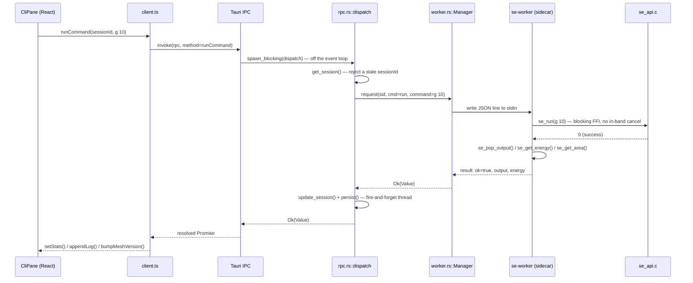
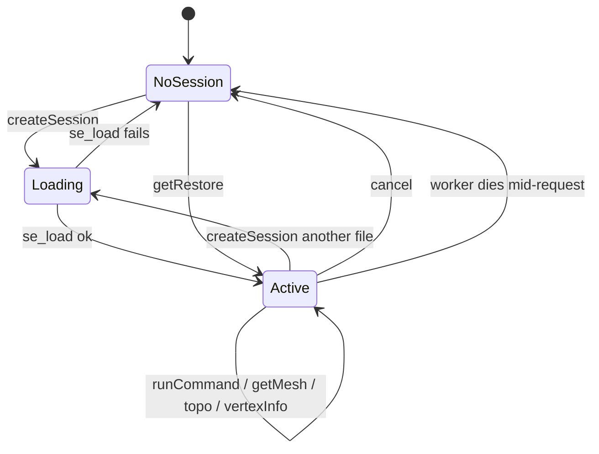
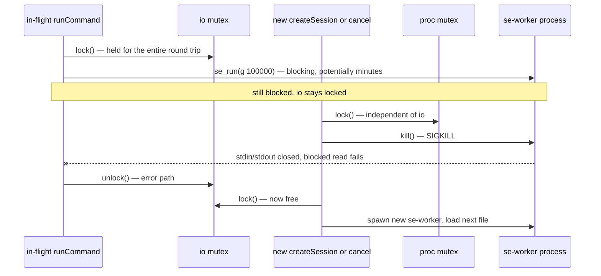
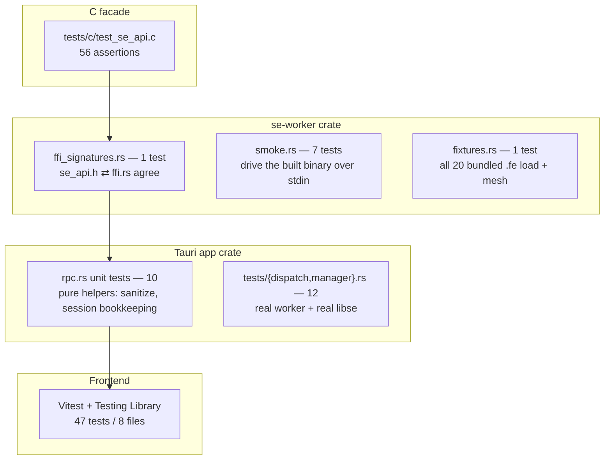
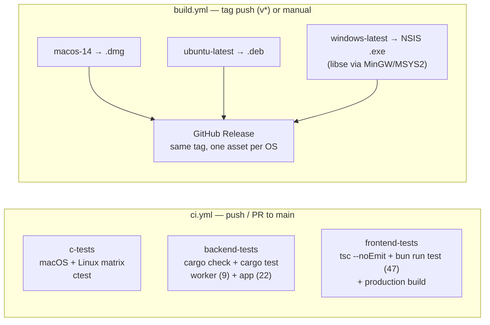

# Architecture

A detailed, diagram-first description of how this app is built and why. For
setup steps and the 11 numbered landmines (non-obvious constraints that have
each cost someone real time), see [`AGENTS.md`](AGENTS.md) — this document
does not repeat those, only the two mechanisms that need a diagram to explain
properly (session/process lifecycle, and the two-mutex kill path).

This is **not a roadmap**. The project has no planned evolution; the
[Known limitations & constraints](#known-limitations--constraints) section at
the bottom is a snapshot of the current implementation's edges, not a to-do
list.

---

## What this is

A desktop app (Tauri v2) that wraps Ken Brakke's **Surface Evolver** — a
~190,000-line C engine from the 1990s for minimizing the energy of
constrained surfaces — in a file picker, a syntax-highlighted `.fe` editor, a
live WebGL viewer, and a command-line pane. Measured, not estimated:

| | Lines | Files |
|---|---|---|
| App code (Rust + TypeScript, excluding tests) | 3,388 | — |
| App test code (Rust integration + Vitest) | 1,423 | — |
| C facade (`engine/bindings/c/`, ours) | 1,071 | 2 |
| Vendored engine (`engine/src/`, never touched) | ~190,600 | 115 |

Roughly **4,500 lines of app + facade code sit over a ~190,600-line vendored
engine** — a ~1:43 ratio. Almost every architectural decision below is an
answer to *"how do we not own 190K lines of 1990s C"*.

---

## System overview

One `se-worker` process exists per loaded file and owns exactly one `libse`
instance — `se_init()` corrupts the heap if called twice in a process, so a
throwaway sidecar per session is the only safe hosting model, not a stylistic
choice. Loading a new file always kills the previous worker first.

---

## Layers

### Frontend — `ui/src/`

React + Vite, no router. `App.tsx` always mounts four panes: **FilePane**
(open-file tabs + a modal file browser), **EditorPane** (CodeMirror over
`.fe` syntax), **ViewerPane** (Three.js mesh render), **CliPane** (command
input + output log). `store/useStore.ts` (Zustand) is the single source of
truth; `api/client.ts` exposes the one `rpc(method, params)` call every
component goes through. Native menu clicks arrive as a Tauri `se-menu` event,
re-dispatched as a DOM `CustomEvent` and routed by `useMenuAction`.

### API layer — `src-tauri/src/rpc.rs`

The entire contract the frontend depends on: one `#[tauri::command] rpc()`
dispatching on a `method` string over 13 methods (session lifecycle, file
management, export, simulation). Holds `AppState` — a `Manager` plus
`Mutex<Option<Value>>` for the single live session (deliberately not a map:
`Manager` only ever runs one worker, so a map would only accumulate ids
nothing serves). Every simulation call revalidates the caller's `sessionId`
against the live one before touching the worker.

### Tauri services — `worker.rs`, `main.rs`, `lib.rs`, `menu.rs`

The process-lifecycle plumbing, decoupled from RPC semantics:

- **`worker.rs::Manager`** — two separate mutexes (`io` for the request/
  response round trip, `proc` for the process handle only) so a hung
  `se_run` can still be killed. See [Session & process lifecycle](#session--process-lifecycle)
  below.
- **`main.rs`** — builds the Tauri app, registers `rpc`, builds the native
  menu, and kills the active worker on `WindowEvent::Destroyed` so quitting
  never orphans a subprocess blocked on a stdin read.
- **`lib.rs`** — splits the app into a library target purely so
  `src-tauri/tests/` has something to link against; `rpc()` is generic over
  `R: Runtime` so tests drive it with `tauri::test::MockRuntime`.
- **`menu.rs`** — native File/Edit/View/Run menu; re-emits custom item
  clicks as the `se-menu` event.

### Backend — `src-tauri/worker/` (se-worker sidecar)

A standalone Rust crate — **not** a Cargo workspace member, because Cargo
ignores `[profile]` overrides (`lto`, `panic`) inside workspace members, and
joining one would force `panic = "abort"` onto the whole Tauri app. Reads
line-delimited JSON from stdin, dispatches to one of 6 commands
(`load run mesh topo vertex_info dump`), writes one JSON result line back.
Handlers are synchronous, so a blocking `se_run` simply blocks the loop —
there is no concurrency to reason about inside the worker. `ffi.rs` holds 28
raw `unsafe extern "C"` function pointers resolved by `libloading`, checked
against `se_api.h` by a dedicated bidirectional test (a mismatch is undefined
behaviour, not a compile error).

### C facade — `engine/bindings/c/se_api.{h,c}`

28 exported functions, trimmed from 37 in the 0.2.1 release (12
never-called accessors deleted: facet normals, edge length/density, generic
attributes, six vertex scalar fields). One return-value convention across
all of them: `-1` bad arguments/failure, `0` not applicable to this surface,
`>0` elements written. This is the only file that is allowed to know both
"how Surface Evolver represents a surface" and "what a byte buffer for an
FFI caller looks like."

### Vendored engine — `engine/src/`

115 files, ~190,600 lines, unmodified 1990s Surface Evolver. No
`.clang-format` exists on purpose — a tool tuned to this era's style would
start reformatting every file the first time someone ran it. Read only
through the facade above.

---

## Request lifecycle

A full round trip for `runCommand` (e.g. the Run ▸ Iterate ×10 menu item,
which sends `g 10`):

`se_run` is a single blocking FFI call with no progress protocol — nothing
ever emits the reserved progress message the IPC protocol reserves a slot
for — so a large iteration count simply holds the whole chain above open
until it returns.

---

## Session & process lifecycle

A few of those transitions hide a real decision:

- **`se_load` fails** → the worker is discarded outright, not kept around —
  engine state after a failed load is undefined.
- **`createSession` while `Active`** → `kill()` runs *before* the new worker
  spawns, never after, so there's never a moment with two workers alive.
- **`cancel`** → `kill()`; the in-memory surface is lost, but the last
  auto-snapshot survives on disk for `getRestore`.
- **worker dies mid-request** → detected as an EOF on the read side, then
  reaped — a bad JSON line or a transient pipe error does *not* count as a
  death and leaves the worker running.
- **`getRestore`** → only fires if no session exists yet; it replays the
  last persisted `.dmp` snapshot.

`cancel` is the only cancellation there is: `se_run` cannot be interrupted
in-band, so "cancel" means killing the process. That's only possible because
`Manager` splits its state across two mutexes instead of one:

If `io` and `proc` were the same mutex, `kill()` could never run while a
command was in flight, and a long `g N` would be genuinely uncancellable
rather than just slow.

---

## IPC protocol reference

stdin/stdout, one JSON object per line, no batching:

| `cmd` | Purpose | Notable response fields |
|---|---|---|
| `load` | Open a `.fe` file (chdir's to its directory first, for relative includes) | `energy area scale sdim` element counts, `bbox_min/max` |
| `run` | Execute one raw SE command string via `se_run` | `output energy area` |
| `mesh` | Fetch vertices/edges/facets (+ optional colours) for rendering | `vertices facets edges body_cms`, optional `facet_colors edge_colors`, optional `wrapped_edges_hidden` |
| `topo` | One of 4 mapped topology ops (`refine equi vertex_avg pop`) | `output counts` (non-zero deltas only) `energy energy_delta area` |
| `vertex_info` | Detail for one vertex by position | `id xyz attr constraints` |
| `dump` | Write `.dmp` state to a temp path, read it back | `content` |

Every response is `{"type":"result","ok":true|false,…}`, or
`{"type":"fatal","error":…}` if `dlopen`/`se_init` failed at process start.

---

## Testing architecture

Closed the last untested layer (September 2026) after an audit found
`rpc.rs`, `worker.rs` and the entire UI had zero coverage:

`worker/tests/fixtures.rs` in particular replaced a manual shell loop with a
real test: it now fails CI, rather than waiting for someone to notice, if a
change ever breaks loading or meshing any bundled datafile.

---

## Build & release pipeline

Two independent workflows:

The macOS build is ad-hoc signed (no Developer ID/notarization) — first
launch needs right-click ▸ Open, or `xattr -dr com.apple.quarantine`.

---

## Known limitations & constraints

No roadmap exists for this project — what follows is a factual inventory of
where the current implementation stops, not a backlog. Item ids (`F#`, `A#`,
`P#`) match the historical identifiers still cited in source comments and
`CHANGELOG.md`.

### Model & representation

- **SOAPFILM only.** `se_load` rejects `STRING` and `SIMPLEX_REPRESENTATION`
  datafiles outright with an explanation — neither model's cells can be
  expressed by the triangulated-facet mesh API. The engine still computes
  them; `se_run` still reaches them.
- **Curved (Lagrange order > 1) patches render as straight edges.** The app
  warns rather than tessellating the curve. 
- **Two per-element accessors were deleted in the 0.2.1 trim and never
  restored:** generic vertex/edge/facet attributes (`se_get_attribute_*`)
  and facet normals (`se_get_facet_normals`) — so there is no per-attribute
  color overlay and no flat-shaded-normal toggle. Both are recoverable from
  git history if a feature ever needs them.
- **Attributes are captured at load time only.** One defined by a `.fe`
  command section after load (e.g. via `recalc`) won't appear in the vertex
  inspector until the file is reloaded.

### Foam / multi-body surfaces

Only 3D SOAPFILM periodic foam ships today (`phelanc.fe`, `twointor.fe`,
`symtest.fe`, `octa.fe`); the 2D STRING foam files this audit originally
measured against (`100grain.fe`, `5pb.fe`) were removed from the bundle in
0.2.1 along with the STRING-rejection change, which also closed the "2D
cells don't render" finding those files demonstrated.

- **Body volumes/pressures are computed and sent on every `getMesh` call but
  have no frontend type or UI** — `MeshData` doesn't declare either field.
  Today's only way to read them is `print body[N].volume` or a
  `foreach body` loop in the CLI pane. 
- **No facet→body accessor is exposed**, so a multi-body surface (e.g.
  `phelanc.fe`'s 8 cells) can't be colour-coded per body.
- **`runCommand` reports only energy/area, never topology-counter deltas.**
  Only the four wired `topo` operations diff `se_get_topo_counts`; a plain
  `g 500` coarsening run's pops/edgeswaps/dissolves (the physics of
  interest for foam) are invisible unless driven through a `topo` button.
  (F5)
- **Only 4 topology operations have a button** (`refine`, `equi`,
  `vertex_avg`, `pop` → `pop vertices`). Foam-relevant engine operations —
  `o`/`O` (pop edges/vertices variants), `t x` (tiny-edge removal),
  `t1_edgeswap`, `dissolve`, `pop_tri_to_edge`, `pop_edge_to_tri`,
  `pop_quad_to_quad`, `edgeswap` — are CLI-only.

### Structured UI vs. the CLI escape hatch

By design (any gap here is a missing button, not missing capability — see
`AGENTS.md` landmine 8), no panel exists for:

- Hessian/eigenvalue stability analysis (`eigenprobe(0)`, `ritz(0,n)`).
- One-click `edgeswap`, `dissolve`, `weed`, `notch`, `autochop`, `detorus`,
  `rebody`, `optimize`, `conj_grad`, `jiggle`, `saddle`. 
- Macros / saved command snippets. 
- Structured rendering of `list`/`print`/`histogram` output — it's raw text
  in the CLI output log. 
- Defining or viewing quantities, constraints, methods, or physics/mesh
  parameters at all — the Quantities and Settings panels that used to cover
  part of this were removed entirely in 0.2.1. It's CLI (`set`, `print`,
  `v`) or direct `.fe` edits only now. 

### Frontend & backend architecture debt

From the 2026-08-09 architecture audit; unchanged by the September 2026
test-suite work, which added coverage without touching any of these:

- **Mesh payload is the ceiling.** Measured on `cube.fe`: 4 refines =
  3,074 vertices / 6,144 facets ≈ 278 KB of JSON; 6 refines = 49,154
  vertices / 98,304 facets ≈ 5.36 MB. It crosses two IPC boundaries with
  several serialize/parse passes each, and refetches in full on **every**
  mutating action, not just the elements that moved. Binary transport
  (`tauri::ipc::Response`) would remove most of that cost.
- **No incremental refetch.** `g N` only moves vertex positions; facets and
  edges are invariant unless a topology op ran — detectable via
  `se_get_topo_counts` — but the frontend always refetches everything.
- **No typed contract at any seam.** `rpc.rs` takes and returns
  `serde_json::Value` throughout; the frontend's payload types are unchecked
  assertions on `invoke<T>`. Drift has already shipped once (a worker field
  with no matching frontend type).
- **No render discipline in the store.** All 7 call sites (`App.tsx`,
  `FileBrowserModal`, `FilePane`, `CliPane`, `EditorPane`, `ViewerPane`,
  `useMesh`) destructure the entire Zustand store with zero selectors — any
  single `appendLog` line re-renders all of them.
- **`dispatch()` is one 13-arm match, ~180 lines**, with `get_session` /
  `update_session` / `persist` called from 8 / 4 / 3 sites respectively.
  Fine at this size; will need restructuring if the method count grows
  further.

### Known bugs / rough edges

- A compound interactive command (e.g. `f; g`) can still block the worker on
  stdin the way a bare interactive command does — the `INTERACTIVE_CMDS`
  guard only catches the single-letter form. Reload to recover.
- macOS builds are ad-hoc signed, not notarized.
- AppImage packaging is disabled in `build.yml`. The original blocker
  (linuxdeploy's `ldd` choking on the old statically-linked bun sidecar) is
  gone now that the sidecar is a normal dynamically-linked Rust binary, but
  nobody has re-verified it on a Linux runner.
- `panic = "abort"` in the worker means a genuine bug kills the sidecar
  (session lost, last snapshot recoverable) instead of returning a clean
  error — an accepted trade-off for the 345 KB release profile.
- `se_get_edge_colors` has no dedicated C-level test; it's exercised only
  indirectly through the worker's smoke tests.

### Assessed and deliberately not building

- **A worker heartbeat for long `se_run` calls.** A blocking FFI call can't
  emit progress while blocked, in any single-threaded host. Chunking on the
  caller side (`g 50` × 20, reporting between chunks) would work; nothing
  does this today.
- **`.dmp` re-import validation** — guards a feature that doesn't exist
  (uploads are `.fe`-only).
- **Multi-session / multi-window** — the engine is one-worker-per-session by
  construction; open-file tabs are a recently-used list, not live parallel
  sessions.
