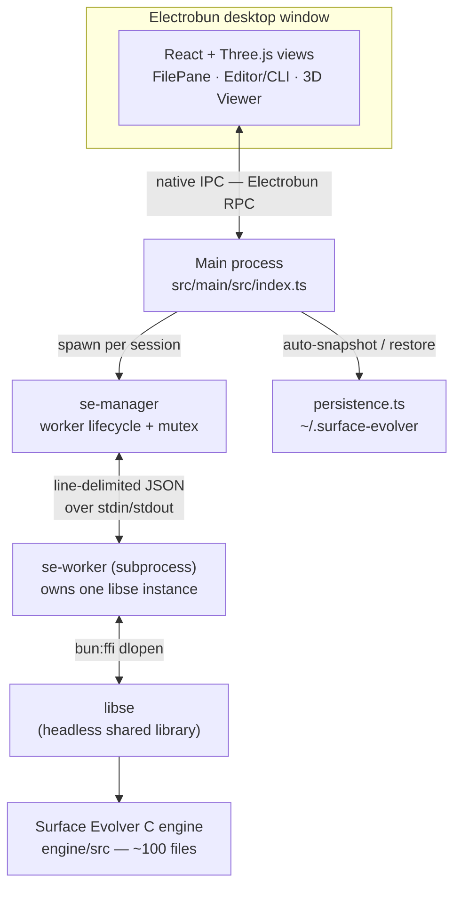
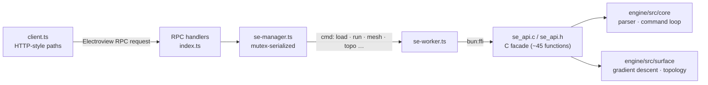

# Surface Evolver

A native **desktop app** that wraps the [Surface Evolver](https://facstaff.susqu.edu/brakke/evolver/evolver.html) C engine in an interactive three-pane interface: a file browser, a command line, and a live 3D viewer. It runs as a real desktop window via [Electrobun](https://blackboard.sh/electrobun/) (a Bun-based Electron alternative) — no browser, no server, no HTTP.

## What it does

Surface Evolver minimizes the energy of surfaces subject to constraints — volumes, pressures, boundary conditions — using gradient descent and other methods. It's widely used in physics, materials science, and computational geometry.

This project drives the original C engine directly through `bun:ffi`, so you get the full Surface Evolver command language in the CLI pane, plus first-class UI for the common workflow (load → evolve → refine → inspect → export) and a WebGL viewer that renders the mesh as it evolves.

## What you can do

- **Load** any bundled `.fe` file, or upload your own (the **+** button in the file pane). Open several as tabs.
- **Run the full SE command language** in the CLI pane — anything you'd type in the real Evolver (`g`, `r`, `u`, `hessian`, `ritz`, quantity/constraint definitions, macros like `gogo := { … }`, …).
- **Evolve & refine** via the Run menu / keyboard: iterate (`⌘G`), Refine (`⌘R`), Equiangulate (`⌘U`), Vertex Average (`⌘E`), Pop.
- **Visualize** in 3D: Solid / Wireframe / X-Ray modes, native SE per-element colours, full edge overlay, orbit + reset camera.
- **Inspect**: click a vertex for its id, coordinates, constraints and flags; body centre-of-mass markers.
- **Panels**: named quantities + energy breakdown; mesh-quality and physics settings (min area/length, gravity, pressure).
- **Export** the current surface as `.fe` or an exact-state `.dmp`.
- **Auto-restore** — your evolved surface comes back after a restart.

## What you can't do (yet)

- **Only one live session at a time.** The engine is one-worker-per-session, so open files are tabs — switching reloads; background tabs aren't kept warm.
- **Power features are CLI-only** (they work, just no buttons): Hessian/eigenvalue stability analysis, and advanced ops like `edgeswap`, `dissolve`, `jiggle`, `optimize`, `conj_grad`, `saddle`.
- **Defining** quantities / constraints / methods happens in the CLI or the `.fe` file — the panels are view-only.
- **No scalar heat-map colormaps** (curvature/valence/…); the viewer shows native SE colours only.
- **No native graphics window or PostScript export** — the WebGL viewer replaces them.
- **Windows isn't supported** — run under WSL.

## Known issues

- **`simplex3.fe` and `slidestr.fe` are hidden** — `simplex3` (SIMPLEX model) loads and runs but renders empty (simplex cells aren't exposed by the mesh API); `slidestr` is a malformed bundled datafile the engine rejects at load.
- **Curved (Lagrange/quadratic) patches render as straight edges** — you'll see a warning in the log; the geometry is approximate.
- **Attributes defined in a datafile's *command* section** don't appear in the colour/inspector lists until the file is reloaded (header-defined attributes are fine).
- **Closing the active tab clears the viewer** — it doesn't auto-switch to another open file.
- **Distributables are unsigned** — macOS Gatekeeper will warn on first open (right-click → Open); Linux artifact is pending its first CI build.

## Overall architecture

One worker subprocess owns exactly one `libse` instance per session — `libse` can't be initialized twice in the same process, so loading a new file spawns a fresh worker.



## API architecture

The frontend "API client" uses HTTP-style call paths purely as a naming convention — every call is native IPC, not a network request. A request threads through five layers down to the C facade and back:



The C facade (`engine/bindings/c/se_api.h`) exposes structured getters/setters — geometry (vertices/edges/facets/normals), energy/area, quantities + energy methods, physics, mesh params, body volumes + centre-of-mass, per-vertex scalar fields, constraints, attributes — plus a universal `se_run` escape hatch that gives the CLI pane the entire command language. Graphics-only engine globals excluded from the headless build (bounding box, normals, body CM) are recomputed inside the facade.

## Stack

| Layer | Technology |
|---|---|
| Core engine | C — parser, gradient descent, mesh topology (~100 files) |
| C API | `engine/bindings/c/se_api.{h,c}` — ~45-function facade with stdout/stderr capture |
| Native binding | `bun:ffi` `dlopen` in a worker subprocess |
| Desktop shell | Electrobun (Bun runtime, native WKWebView / GTK-WebKit) |
| 3D rendering | Three.js + @react-three/fiber + drei |
| Frontend | React + Vite, Zustand store, Tailwind + daisyUI, heroicons |
| Build | CMake (`libse` shared lib + `surface_evolver` CLI); Electrobun bundler |

## Repository layout

```
surface-evolver/
├── engine/
│   ├── src/                    # Surface Evolver C engine
│   │   ├── core/               # Parser, expression evaluator, command loop
│   │   ├── surface/            # Gradient descent, topology, hessian
│   │   └── graphics/           # Display backends (excluded from headless libse)
│   └── bindings/c/             # se_api.h / se_api.c — C facade
├── src/
│   ├── main/src/               # Electrobun main process (Bun)
│   │   ├── index.ts            # App entry, RPC handlers
│   │   ├── se-manager.ts       # Worker lifecycle + mutex
│   │   ├── se-worker.ts        # Subprocess: owns libse via bun:ffi
│   │   ├── bootstrap-paths.ts  # Resolves bundled resources in a packaged app
│   │   ├── persistence.ts      # Auto-save / restore the evolved surface
│   │   └── config.ts           # Env-var configuration
│   └── views/src/              # React + Vite frontend
│       ├── components/         # FilePane, CliPane, EditorPane, ViewerPane
│       ├── store/              # Zustand store (single source of truth)
│       └── api/                # RPC client + per-resource modules
├── fe/                         # Bundled .fe datafiles (cube, sphere, octa, …)
├── tests/c/                    # CTest integration tests for the C API
├── scripts/build-native.ts     # Builds + stages libse per platform (CI preBuild)
├── electrobun.config.ts        # App bundle config
├── CMakeLists.txt              # Builds surface_evolver CLI + libse shared lib
└── .github/workflows/build.yml # macOS + Linux build matrix
```

## Build & run

```bash
# 1. Build the headless C library (required)
cmake -B cmake-build-debug -DSE_HEADLESS=ON
cmake --build cmake-build-debug

# 2. Install workspaces
bun install

# 3. Launch the desktop app in dev mode (hot reload)
bun run dev
```

### Package a distributable

`electrobun build` runs a preBuild hook (`scripts/build-native.ts`) that compiles
`libse` for the current platform and stages it into the bundle alongside the
`fe/` library and the worker script.

```bash
bun run build:canary    # → artifacts/…-<os>-<arch>-…dmg (+ update bundle)
bun run build:stable    # release channel
```

Cross-platform builds run in CI (`.github/workflows/build.yml`): a macOS + Linux
matrix builds the native library on each runner and uploads the bundled app.
Artifacts are currently **unsigned** — public distribution would add code-signing.
Windows isn't targeted (the C engine needs a POSIX-ish toolchain) — run under WSL.

## Tests

```bash
# C API tests (requires built libse)
ctest --test-dir cmake-build-debug --output-on-failure

# Frontend type-check
cd src/views && bunx tsc --noEmit
```

## Data files

`.fe` files in `fe/` define the geometry, constraints, and initial conditions for a
simulation. Add one from the **+** button in the file pane (built-in library or your
own upload). Examples: `cube.fe`, `sphere.fe`, `octa.fe`, `mound.fe`, `knotty.fe`,
`catenoid`/`cat.fe`, and more.

---

### A note on this project

This is a **hobby project** — built for fun and curiosity, not backed by any company
or roadmap. The heavy lifting is all Ken Brakke's original Surface Evolver engine;
this repo is just the result of my work for capstone and personal interest.

If any of it is useful to you, please help yourself. **Anyone is welcome to pick it
up, fork it, or take it further** — no permission needed. If you build something neat
on top of it, that's the whole point.
