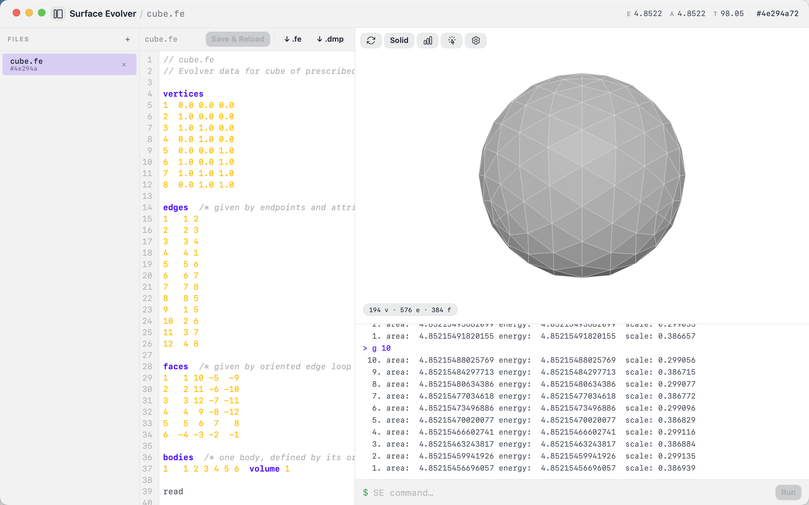
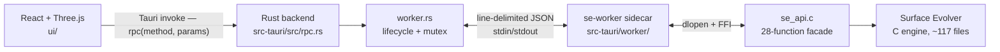

# Surface Evolver Desktop [](https://www.apache.org/licenses/LICENSE-2.0)

A native desktop app for macOS, Linux, and Windows that wraps Ken Brakke's [Surface Evolver](https://facstaff.susqu.edu/brakke/evolver/evolver.html) — a 190,000-line C engine for minimizing the energy of constrained surfaces — in a modern three-pane interface with a live WebGL viewer. It exists because the original ships as a terminal program with an X11 graphics window, which is a hard sell in 2026 even for the researchers who depend on it.

**[Live Demo / Downloads](https://surface-evolver.vercel.app)**

---

## Preview

<picture>
  <source media="(prefers-color-scheme: dark)" srcset="docs/screenshot-dark.png">
  
</picture>

*`cube.fe` refined twice and evolved to a sphere under its volume constraint — energy, area and mesh counts update live in the titlebar.*

## Features

Everything below is what the **desktop app** adds. The original engine's full command language is preserved verbatim — nothing was taken away.

- **Live WebGL viewer**: Three.js rendering with solid / wireframe / X-ray modes, native SE per-element colors, an all-edge overlay, orbit controls and auto-fit camera. The original offers a basic X11/OpenGL window that many users never get working.
- **Correct periodic (torus) rendering**: foam and crystal models wrap around a periodic cell. A new C accessor exposes SE's per-edge wrap codes so wrapped edges are hidden instead of drawn as long lines across the view — *measured:* 103 of 368 edges in `phelanc.fe`. Non-destructive, unlike the engine's own `detorus`.
- **Syntax-highlighted datafile editor** with Save & Reload, so you edit geometry and re-run without leaving the app or restarting the engine.
- **Click-to-inspect vertices**: click any vertex for its id, coordinates, constraints and attribute flags, plus body centre-of-mass markers. In the original this is a `print` statement and a wall of numbers.
- **One-click topology operations** with structured feedback: refine, equiangulate, vertex-average and pop, each reporting element deltas, named topology counters (pops, edgeswaps, dissolves) and ΔE — where the engine prints raw text you have to read.
- **A real Stop button**: `se_run` is a blocking FFI call and cannot be interrupted in band, so cancelling kills the worker process. Your tab stays and the last auto-snapshot survives. In the original, Ctrl-C takes the whole program down with your surface.
- **Crash isolation**: the engine runs in a separate process. An engine segfault or an `exit()` on an unrecoverable error costs you a session, not the application.
- **Session auto-restore**: the surface is snapshotted in the background after every mutating command, so your *evolved* state — not the original datafile — comes back after a restart.
- **Bundled datafile library**: 20 curated examples, all of which render correctly, loadable in one click, plus upload of your own `.fe` files.
- **Export** the current surface as `.fe` or an exact-state `.dmp`, straight to Downloads.
- **Installers for all three platforms** — no compiler, no X11, no build step for end users.

## Tech Stack

- **Core engine**: C — Ken Brakke's Surface Evolver (117 files, flat upstream layout), built headless as a shared library
- **C API**: `engine/bindings/c/se_api.{h,c}` — a 28-function anti-corruption facade with stdout/stderr capture
- **Worker sidecar**: Rust — 345 KB binary, `libloading` (`dlopen`) + `serde_json`
- **Backend**: Rust — Tauri v2, single `rpc(method, params)` command over 13 methods
- **Frontend**: React + Vite, Zustand, Three.js / @react-three/fiber, Tailwind + daisyUI
- **Build**: CMake (engine), Cargo (app + sidecar), Bun (frontend), Tauri bundler; GitHub Actions matrix for macOS / Linux / Windows

## Getting Started

### Prerequisites

- **Rust** (stable) and **Bun**
- **CMake** and a C compiler — Clang, GCC, or MinGW/MSYS2 on Windows
- **Linux only**: `libwebkit2gtk-4.1-dev libgtk-3-dev libayatana-appindicator3-dev librsvg2-dev libxdo-dev libssl-dev`

Just want to run it? Grab an installer from the [releases](../../releases) instead — no toolchain needed.

### Installation

1. Clone the repository:
   ```bash
   git clone https://github.com/sersergious/surface-evolver.git
   cd surface-evolver
   ```
2. Build the headless C engine (required — the app dlopens it at runtime):
   ```bash
   cmake -B cmake-build-debug -DSE_HEADLESS=ON
   cmake --build cmake-build-debug
   ```
3. Install frontend dependencies:
   ```bash
   bun install
   ```
4. Start the development app:
   ```bash
   bun run dev
   ```

There is no `.env` file — the app resolves everything from the bundle. Three optional variables override that for development (the example is based on MacOS):

```env
SE_LIB_PATH=/path/to/libse.dylib     # engine shared library
SE_WORKER_PATH=/path/to/se-worker    # worker sidecar binary
SE_STATE_DIR=~/.surface-evolver      # session snapshot location
```

### Build a distributable

```bash
bun run build   # → src-tauri/target/release/bundle/
```

### Tests

```bash
ctest --test-dir cmake-build-debug --output-on-failure          # C API suite
cd src-tauri && cargo check                                     # Rust backend
cd src-tauri/worker && \
  SE_LIB_PATH=$PWD/../../cmake-build-debug/libse.dylib cargo test  # FFI guard + smoke
cd ui && bunx tsc --noEmit                                      # frontend types
```

## Challenges & Learnings

**Challenge — Driving a 1990s C engine that was never designed to be embedded.**
Surface Evolver assumes it *is* the process: `se_init()` corrupts the heap if called twice, unrecoverable errors call `exit()`, it installs process-wide signal handlers, and a failed file open can drop into an interactive stdin prompt. Every one of those is fatal inside a GUI application.

**Solution** — Rather than fight the constraint, I made it the architecture: one engine instance per process, in a throwaway sidecar the backend spawns and kills. Loading a new file kills the old worker. That turned a liability into three features for free — crash isolation, cancel-by-kill, and a guaranteed-clean engine state on every load. I also kept the engine source pristine and put all coupling in a single C facade, which paid off directly: re-forking the engine from upstream later broke only three files.

**Challenge — FFI, where a mistake is undefined behaviour rather than an error.**
Calling C from a managed runtime means hand-writing signatures the compiler cannot check, and passing raw buffers into code that trusts you about their size. For instance, a variable stride where the implementation always wrote three doubles — sizing a buffer from it would have silently overflowed the heap on 2-D models.

**Solution** — A test that parses the C header and the Rust declarations and asserts they agree, so drift fails CI instead of corrupting memory. I mutation-tested it, because a guard that has never been seen to fail is worth nothing. Buffer lengths are now clamped to what was actually allocated rather than trusting the C return value.

**Challenge — IPC and RPC between three languages in two processes.**
The UI is TypeScript in a webview, the backend is Rust, the engine is C in a *different* process. Every user action crosses all of it and has to come back.

**Solution** — Line-delimited JSON over stdin/stdout to the sidecar, and a single `rpc(method, params)` command as the only frontend-backend seam. Keeping it narrow was the highest-leverage decision in the project: when I migrated the entire desktop framework, the frontend change was one 17-line file. I later ported the sidecar itself from a 58 MB bun/TypeScript binary to 345 KB of Rust, verified by driving both implementations with identical command sequences and diffing the parsed responses.

**Challenge — Owning the whole stack, from numerical C to WebGL.**
Full-stack here spans four languages and a rendering pipeline, and the interesting bugs live *between* the layers — a race between session restore and a user-initiated load, a persistence call blocking the command path, a build script using a shell builtin that does not exist on Windows.

**Solution** — Put a test on every seam, then reduce the number of seams. The C facade carries its own suite (56 assertions), the FFI boundary has the signature guard described above, and the worker protocol is exercised by tests that drive the real binary over stdin the way the backend does. When I replaced the sidecar wholesale, I kept the old implementation building alongside the new one and diffed their parsed responses command by command instead of trusting the rewrite.

The other half was refusing to grow. The C facade went from 37 exports to 28 and the worker from 10 commands to 6, because anything already reachable through the engine's own command language did not need a second structured path to keep correct. Narrowing the models the app *claims* to support — rejecting the two it could never draw honestly — took the bundled library from 17 of 27 datafiles rendering correctly to 20 of 20. Less surface, fewer places for the layers to disagree.

## Design decisions & constraints

- **Soapfilm model only.** `STRING` and `SIMPLEX` datafiles are rejected at load with an explanation. Neither model's cells can be expressed by the triangulated-facet mesh API, so they used to render as a bare edge web or as nothing at all. Rejecting beats drawing a lie — the engine still computes them, and `se_run` reaches them.
- **One live session at a time**, a direct consequence of one-engine-per-process. Open files are tabs; switching reloads.
- **The C facade is kept to what the app calls.** Accessors built for removed features were deleted rather than left to rot; they are recoverable from git history.
- **Structured API only where it earns its place.** The physics and named-quantity panels were removed because `set gravity_constant 980`, `print body[1].volume` and `v` already do the job through the command line — a structured duplicate is a second thing to keep correct.
- **Power features are CLI-only** (they work, there are just no buttons): Hessian/eigenvalue stability analysis, `edgeswap`, `dissolve`, `jiggle`, `optimize`, `conj_grad`, `saddle`.
- **Known rough edges**: curved Lagrange patches render as straight edges; a compound interactive command such as `f; g` can still block the worker (reload to recover); macOS builds are ad-hoc signed, not notarized, so first launch needs right-click → Open.

## Architecture

One worker subprocess owns exactly one `libse` instance. A request threads from the webview down to the C engine and back:


```mermaid
flowchart LR
    UI["React + Three.js<br/>ui/"] -->|"Tauri invoke — rpc(method, params)"| RPC["Rust backend<br/>src-tauri/src/rpc.rs"]
    RPC --> Mgr["worker.rs<br/>lifecycle + mutex"]
    Mgr <-->|"line-delimited JSON<br/>stdin/stdout"| W["se-worker sidecar<br/>src-tauri/worker/"]
    W <-->|"dlopen + FFI"| Facade["se_api.c<br/>28-function facade"]
    Facade --> Engine["Surface Evolver<br/>C engine, ~117 files"]
```

## License

Distributed under the Apache License 2.0. See [`LICENSE`](LICENSE) for details.

The engine is Ken Brakke's original Surface Evolver; this repository is a wrapper around it, built as a capstone and out of personal interest. It is not production-grade — if you plan to rely on it for research, test the functionality you need first. Anyone is welcome to fork it or take it further.

## Note on AI Use in the Project

This project demonstrates a critical lesson: **AI tools are force multipliers, but only with disciplined methodology.**

### Initial Approach: Vibe Coding Failure

Early iterations used Claude Code exploratively, treating AI output as trusted implementation. The result was as expected: bugs, architectural inconsistencies, and downstream failures that compounded as the codebase grew. This "vibe coding" approach—accepting generated code without rigorous verification—taught me that speed without scrutiny is false velocity.

### Refined Approach: Agentic Coding and Manual Verification

I restructured my workflow around **semantic verification**: every generated line requires manual inspection for correctness, safety, and alignment with architecture. This means:

- Reviewing generated logic against implementation intent
- Validating error handling and edge cases
- Catching architectural violations before integration
- Understanding *why* code works, not just *that* it works

### Impact

This disciplined use of AI delivered measurable benefits:
- **Productivity:** Tackled substantially more complex problems than would be feasible otherwise
- **Code Quality:** All shipped code passed rigorous review, despite accelerated development
- **Learning:** Deep engagement with each component (required for verification) strengthened my understanding of systems design

### Bottom Line

AI is a powerful tool for scaling capability, but it requires treating it as a *code generator* that needs review, not a *code oracle* to be trusted. While most code in this project was AI-generated, **all code was manually reviewed and validated for correctness and safety** before inclusion.